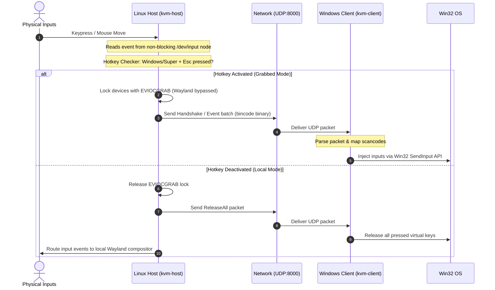

# WayKVM

[](https://www.rust-lang.org/)
[](LICENSE)
[](#)

A high-performance, ultra-low-latency network-based Software KVM (Keyboard/Mouse sharing) application written in Rust. It allows you to seamlessly share physical input devices from a Wayland-based Linux host (e.g. Fedora running Niri, Sway, or Hyprland) to a Windows 11 client over a secure local UDP connection.

> [!IMPORTANT]
> **Directional Limitation Notice:**
> WayKVM is currently strictly **asymmetric**. It functions ONLY with Linux as the Host (sending inputs) and Windows as the Client (receiving/injecting inputs). The reverse configuration (Windows Host $\rightarrow$ Linux Client) is not supported out-of-the-box.

---

## 📖 Setup Guides

*   **Looking for a quick reference?** Keep reading this document.
*   **Need step-by-step, beginner-friendly instructions?** Read our detailed [Step-by-Step Installation Guide (INSTALL.md)](INSTALL.md) which walks you through installing Rust, compiling, configuring Windows Firewall rules, and device scanning.

---

## 🚀 Architecture Overview

WayKVM works by capturing raw events from Linux input nodes (`/dev/input/event*`), serializing them into a space-efficient binary format using `bincode`, and streaming them to Windows over UDP. The Windows client then maps and injects these events into the OS input queue at the driver level.



---

## 🛠️ Quick Installation

For advanced users familiar with terminal utilities and compilers:

### 1. Compile Host (Linux)
```bash
cargo build --release -p kvm-host
```
Outputs binary to `target/release/kvm-host`.

### 2. Compile Client (Windows)
```cmd
cargo build --release -p kvm-client
```
Outputs executable to `target\release\kvm-client.exe`.

### 3. Open Port 8000 on Windows Firewall
Run in **PowerShell as Administrator**:
```powershell
New-NetFirewallRule -DisplayName "WayKVM Client Receiver" -Direction Inbound -Action Allow -Protocol UDP -LocalPort 8000
```

---

## 🚦 Running WayKVM

### Step 1: Start Client (Windows)
Run in PowerShell (or Command Prompt) inside the output directory:
```powershell
.\kvm-client.exe --bind 0.0.0.0:8000
```

### Step 2: Start Host (Linux)
Run as **root/sudo** to grant hardware access:
```bash
sudo ./target/release/kvm-host --client <WINDOWS_CLIENT_IP>:8000
```
*   Use `--name <FILTER>` to match device names (e.g. `--name Razer`), or `--device <PATH>` to open a specific input node directly.
*   Use `--hotkey <KEY_COMBO>` (default `"meta+esc"`) to customize the grab/release shortcut. Supported format: keys combined with `+` or `,` (e.g., `ctrl+alt+k` or `meta+esc`). You can also specify raw evdev keycodes directly.

### Step 3: Toggle
Press **`Super + Esc`** (Windows key + Escape) to grab/release hardware focus.

---

## 🕶️ Running in the Background

If you do not want to keep open terminal windows active, you can run both the host and client silently in the background using startup scripts.

### 1. Windows Client Background Script (`start-client.bat`)
Create a file named `start-client.bat` in the same directory as `kvm-client.exe`:
```cmd
@echo off
:: Launches the client in a hidden window
powershell -WindowStyle Hidden -Command "Start-Process .\kvm-client.exe -ArgumentList '--bind 0.0.0.0:8000' -WindowStyle Hidden"
```
*To stop the background client, search for `kvm-client` in the Windows Task Manager and terminate the process.*

### 2. Linux Host Background Script (`start-host.sh`)
Create a file named `start-host.sh` on your Linux machine:
```bash
#!/bin/bash
# Start kvm-host in the background using nohup
sudo nohup ./target/release/kvm-host --client <WINDOWS_IP>:8000 --name "Logitech" > /dev/null 2>&1 &
echo "WayKVM host started in the background."
```
Make the script executable:
```bash
chmod +x start-host.sh
```
*To stop the background host, run:*
```bash
sudo killall kvm-host
```

---

## ⚠️ Safety & Emergency Recovery

The host daemon uses the Linux `EVIOCGRAB` system call to redirect inputs, making the host OS blind to the keyboard and mouse. 

> [!WARNING]
> **Emergency Recovery Plan:**
> If the daemon crashes or hangs while inputs are grabbed, your keyboard and mouse will freeze.
> 1. **SSH Rescue:** Connect to your host via SSH from a second device and run: `sudo killall kvm-host`.
> 2. **TTY Switch:** Press `Ctrl + Alt + F3`, log in, and terminate the process.
> 3. **Physical Reset:** Unplug the USB receiver dongle and plug it back in.

---

## 🤝 Contributing

Contributions to improve WayKVM are highly welcome! We are especially interested in PRs for:
*   Adding reciprocal support for Windows as Host and Linux as Client.
*   Alternative keyboard hotkeys and UI toggles.
*   Cross-compilation scripts.

### Guidelines:
1.  Fork the repository and create your feature branch: `git checkout -b feature/my-new-feature`.
2.  Ensure your code builds cleanly and format it with `cargo fmt`.
3.  Write tests for core protocol changes (run tests with `cargo test`).
4.  Submit a Pull Request with a clear description of your changes.
